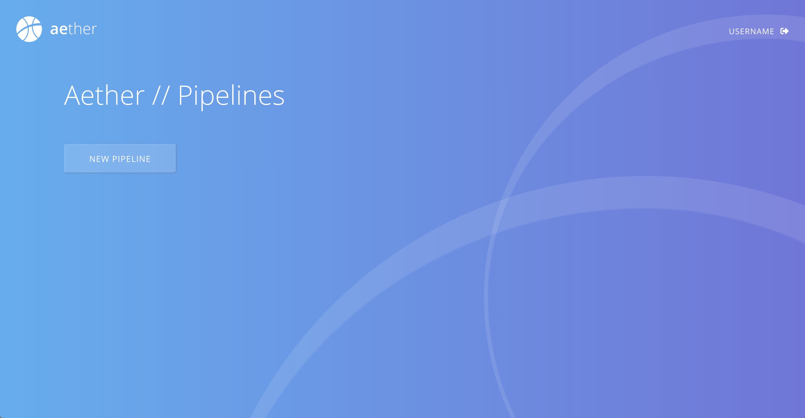
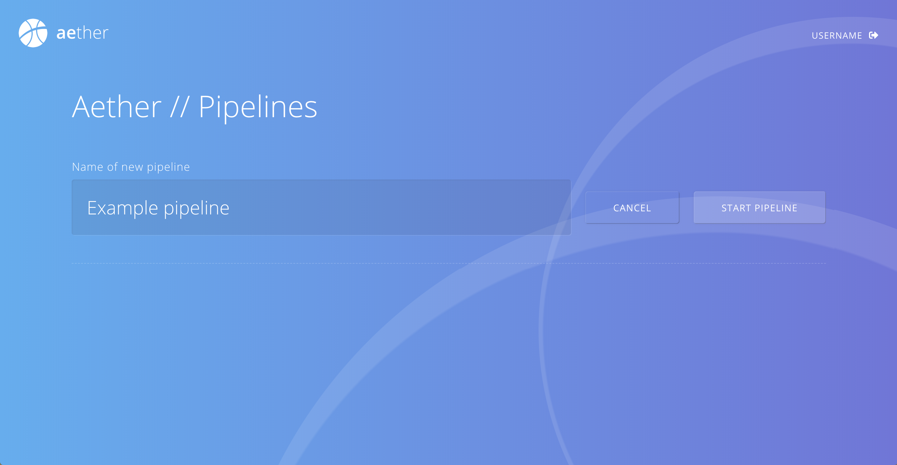

# Creating a pipeline – Introduction

You want to use Aether to make your collected data more meaningful and interoperable with other data sources?

Here is a step by step guide on how to use the Aether interface, that assists you with mapping your existing data structure to your desired output.

Control over your data is back to you!

## Access the Web Interface 

Once you are up and running and you can access aether through `localhost:4000`.
Do you see the Aether Pipeline screen? Great, your setup is working!

## A new Pipeline

Aether starts with an overview screen of all your created pipelines. Since we haven't created any, this list is empty yet.

{: .screenshot}

To create a new pipeline, simply click "NEW PIPELINE", choose a name and hit "START PIPELINE". This will immediately take you to your newly created pipeline.

{: .screenshot}

Once entered a a pipeline you can always go back to the pipelines overview by clicking on "PIPELINES" in the top bar.
There is no need to save your pipeline, all your changes will persist automatically.
Please note that your changes won't have effect on production data, unless you explicitely [publish](pipeline-publish.html) your pipeline.

{: .screenshot}

### And here is what you can do in a pipeline:

## [1. Define your pipeline input](pipeline-input.html)
Choose your Input Source. Maybe you have an AVRO schema you want to use. Or you simply want to add a JSON file, like a data example of your form. In that case we will automatically derive an AVRO schema for you.
## [2. Model your pipeline output](pipeline-output.html)
Learn how to model your data output by using Entity Types.
## [3. Map the input to your output](pipeline-mapping.html)
Create a mapping between fields of your Input source and properties of your Entity Types
## [4. Publish your pipeline](pipeline-publish.html)
Check the output and publish