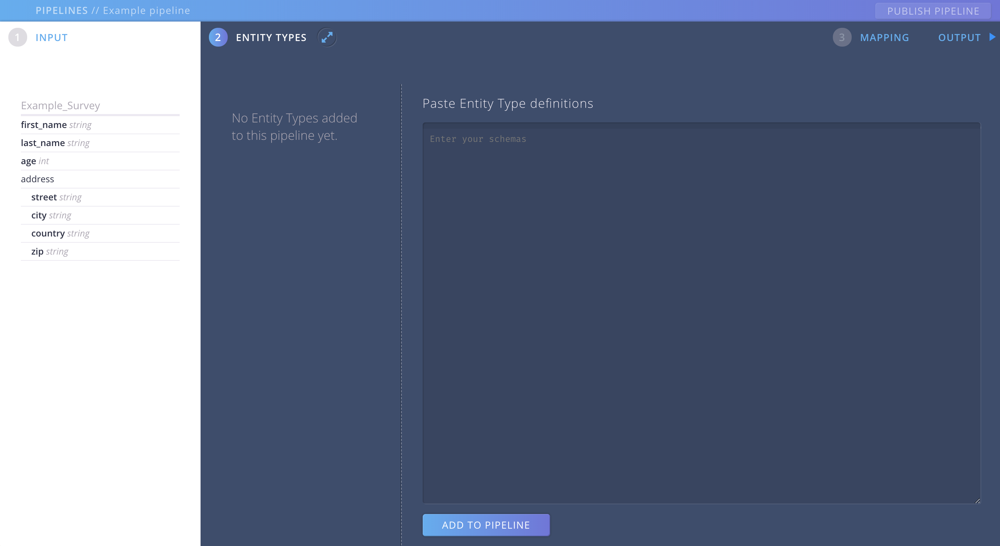
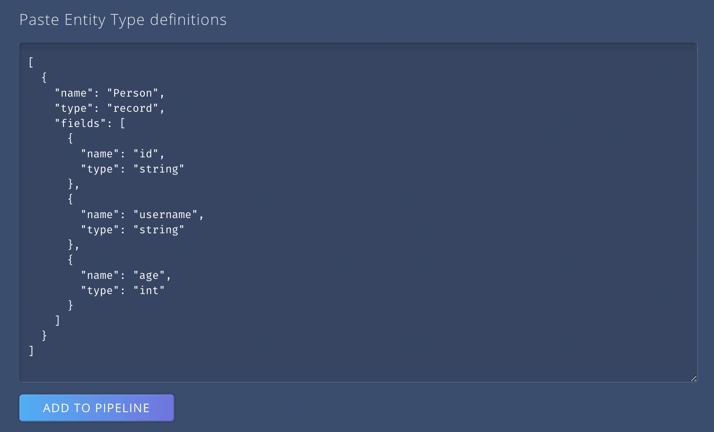
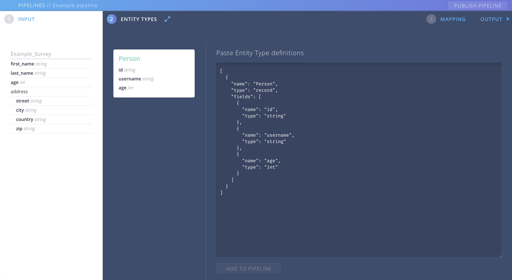
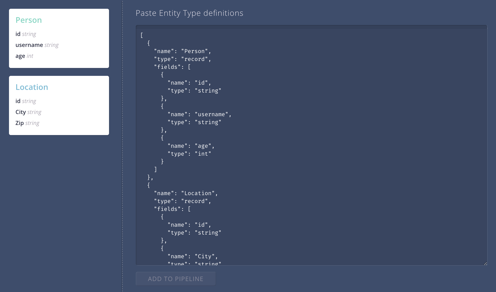

# Model your pipeline output with Entity Types

This is the part where you lay out the different Entity Types you want to generate.

Learn more about Entity Types [here](index.html#entity-types).

## The ENTITY TYPES screen 

{: .screenshot}

See, when switching over to the Entity Types screen, how the schema of your pipeline input stays in view. So you can always see the incoming fields as a reference when modeling your Enitity Types.

In this first release you have to model your Entity Types by hand.
You can use an external Text Editor and then simply paste the code snipped into the text area of the Entity Types screen.
Or you simply type your definitions directly into the textarea.

## Add an Entity Type

We start by adding an Entity Type "Person".

{: .screenshot}

In our example the properties of our person are `id`, `username` and `age`.
We hit "ADD TO PIPELINE" and, voila, we have created our first Entity Type.

Please note that a property of `id` is always required for **every** Entity type. Without the `id` we cannot make proper mappings later on.
{: .hint}

{: .screenshot}

The Entity Type displays on the left hand side of the textarea.

Looking at our input schema we can see we have some more information that we now want to transform to another Entity type.
So let's add a "Location":

{: .screenshot}

We hit again the "ADD TO PIPELINE" button, and we can see, we've now got two Entity Types: A "Person" and a "Location".

{: .screenshot}

We are pretty happy with our Entity Types for now. We can still go back and make changes at any point in time to adjust it to our needs.

### Now that we have defined the input and the desired output of our pipeline, we can get to the core of Aether: 
### [> Create a mapping between source (input) and desitination (output)](pipeline-mapping.html)